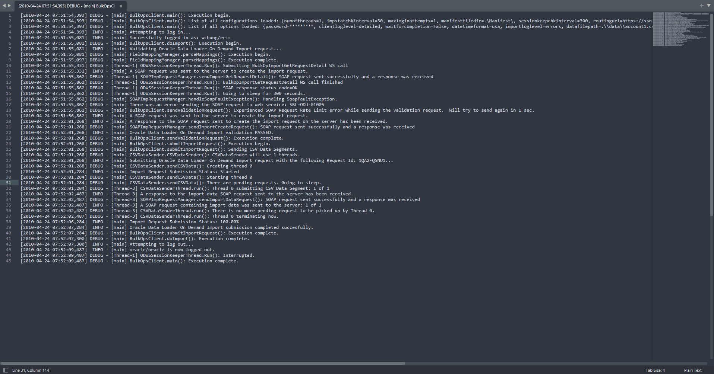

# File Filter Plugin for Sublime Text

## Overview
This plugin allows you to filter file content using regular expressions (RegExp) — **it does not change the file content**.

Matches are highlighted, and text that does not match the RegExp will be folded.

### Features

- File Filtering using RegExp
- Configurable predefined regular expressions
- Supports multiline matching
- Multiple Text Folding Options
  - Adjust how content collapses around matches for better readability
- Customizable Highlighting Styles
  - Highlight matched regions using various styles for better readability

### Installation

1. From the `Command Palette`, run `Package Control: Install Package` command.
2. In the opened packages list, find `FileFilter` package and install it

### File Filter Command

1. From the `Command Palette`, run `File Filter` command
2. Write a RegExp in the prompt (the match may be multiline)
3. The file will be filtered to show only the lines with matches
    - To change the folding style, use the command `File Filter: Folding Style`
    - To change the match areas highlight style, use the command `File Filter: Highlight Style`

### Folding Style Command

Adjust how content collapses around matches for better readability.

1. From the `Command Palette`, run `File Filter: Folding Style` command.

### Highlight Style Command

Adjust how matched text is highlighted.

1. From the `Command Palette`, run `File Filter: Highlight Style` command.

### Quick Panel Command

1. From the `Command Palette`, run `File Filter: Quick Panel` command.
2. A list of quick options will be displayed:
    - `prompt`: same as File Filter command
    - `clear`: clear all filter and highlights - same as exit
    - Additional Predefined RegExp
        - Settings defined options: the remaining of the list can be edited using the `File Filter: Edit Settings` command
        - Add or remove additional predefined RegExp using by editing the `regex_list` property. Each item must be ['description', "regex string"] arrays
3. Choosing an option immediately filters the file.

### Edit Settings Command

1. From the `Command Palette`, run `File Filter: Edit Settings` command.
2. Settings files will be shown.

### Clear Command

Clear all filters.

1. From the `Command Palette`, run `File Filter: Clear` command.
